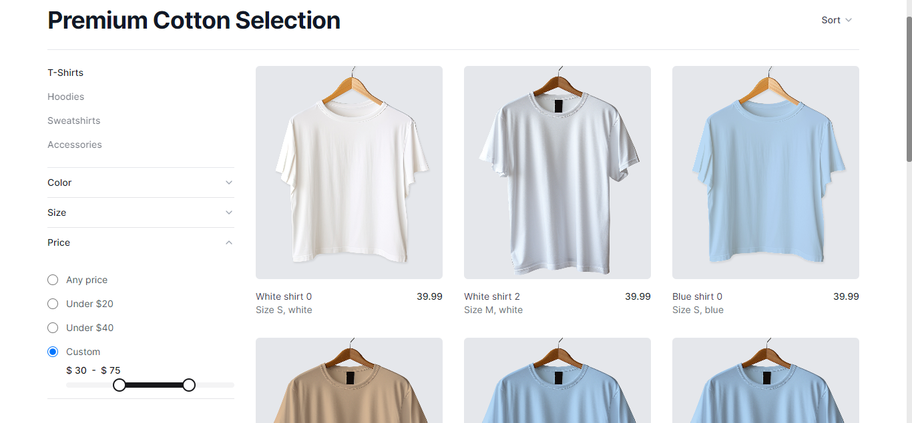

# Filter System

An intuitive web interface that empowers users to effortlessly navigate through vast product catalogs, enabling customers to find items with precision and speed.

## Screenshot



<p align="center">
  <a href="https://filter-system.nabarun.app"><strong>View Project »</strong></a>
</p>

## Running Locally

This application requires Node.js v18.20.1+.

### Cloning the repository to the local machine:

```bash
git clone https://github.com/nabarvn/filter-system.git
cd filter-system
```

### Installing the dependencies:

```bash
pnpm install
```

### Setting up the `.env` file:

```bash
cp .env.example .env
```

### Seeding the application:

```bash
pnpm seed
```

### Running the application:

```bash
pnpm dev
```

## Tech Stack:

- **Language**: [TypeScript](https://www.typescriptlang.org)
- **Framework**: [Next.js](https://nextjs.org)
- **Styling**: [Tailwind CSS](https://tailwindcss.com)
- **Analytics**: [Vercel Analytics](https://vercel.com/analytics)
- **Vector Database**: [Upstash](https://upstash.com/docs/vector/overall/getstarted)
- **Deployment**: [Vercel](https://vercel.com)

## Credits

Learned a ton while building this project. All thanks to Josh for the next level (no pun intended) tutorial!

<hr />

<div align="center">Don't forget to leave a STAR 🌟</div>
